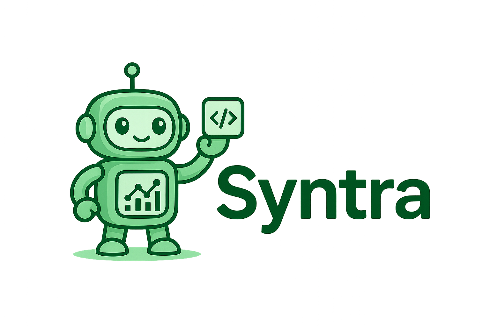

<div align="center">
  
  
  # Syntra
  ### Reverse Tunnel System for API Testing
  
  <p>
    <em>Making localhost global, one tunnel at a time! 🚀</em>
  </p>
  
  [](LICENSE)
  [](https://golang.org)
  []()
</div>

---

Syntra is a comprehensive full-stack SaaS platform that automatically generates synthetic data and test cases for your backend API endpoints. It seamlessly integrates with your localhost environment, runs iterative tests, and provides detailed analytics on your API performance and reliability.

## 🌟 Features

- **Reverse Tunnels**: Expose your localhost to the internet securely (like Ngrok/Cloudflared)
- **WebSocket-based**: Real-time, persistent connections with automatic reconnection
- **API Testing**: Automated test case generation and execution
- **Analytics**: Detailed performance metrics and test results
- **Cross-platform CLI**: Works on Windows, macOS, and Linux
- **RESTful API**: Complete API for integration with your applications

## 🏗️ Architecture

```
┌─────────────────┐    ┌──────────────────┐    ┌─────────────────┐
│   Syntra CLI    │◄──►│  Go Fiber Server │◄──►│ Testing Engine  │
│  (User's PC)    │    │  (Your Backend)  │    │   (API Tests)   │
└─────────────────┘    └──────────────────┘    └─────────────────┘
         │                        │                        │
    localhost:3000          WebSocket Tunnel         Test Results
                                  │
                    ┌──────────────────┐
                    │  Reverse Proxy   │
                    │ *.syntra.dev     │
                    └──────────────────┘
```

## 🚀 Quick Start

### 1. Start the Syntra Server

```bash
cd /Users/aryaman.raj/projects/Syntra
go run main.go
```

The server will start on port 8080 by default.

### 2. Build and Use the CLI

```bash
# Build the CLI
cd cli
go build -o syntra .

# Connect your localhost:3000 to the internet
./syntra connect 3000
```

You'll see output like:
```
🚀 Starting Syntra tunnel...
📡 Server: wss://localhost:8080
👤 User ID: user123
🔌 Local Port: 3000

🎉 Tunnel established!
🆔 Tunnel ID: abc123-def456
🌐 Public URL: https://user123-abc123.syntra.dev
🔀 Forwarding: https://user123-abc123.syntra.dev -> localhost:3000

💡 You can now access your local app at: https://user123-abc123.syntra.dev
```

### 3. Test Your API

```bash
# Create a test suite
curl -X POST http://localhost:8080/test/suites \
  -H "Content-Type: application/json" \
  -d '{
    "name": "My API Tests",
    "base_url": "https://user123-abc123.syntra.dev",
    "test_cases": [
      {
        "name": "Health Check",
        "method": "GET",
        "path": "/health",
        "expected": {
          "status_code": 200
        }
      }
    ]
  }'

# Execute the test suite
curl -X POST http://localhost:8080/test/suites/{suite-id}/execute \
  -H "Content-Type: application/json" \
  -d '{
    "tunnel_url": "https://user123-abc123.syntra.dev"
  }'
```

## 📡 API Endpoints

### Tunnel Management

| Method | Endpoint | Description |
|--------|----------|-------------|
| `GET` | `/tunnel/ws/connect` | WebSocket endpoint for CLI connections |
| `POST` | `/tunnel/create` | Create a new tunnel (REST API) |
| `GET` | `/tunnel/:tunnelId` | Get tunnel information |
| `GET` | `/tunnel/user/:userId` | Get user's active tunnels |
| `DELETE` | `/tunnel/:tunnelId` | Terminate a tunnel |
| `GET` | `/tunnel/active` | List all active tunnels |
| `GET` | `/tunnel/health/:subdomain` | Check tunnel health |
| `GET` | `/tunnel/stats/:subdomain` | Get tunnel statistics |

### API Testing

| Method | Endpoint | Description |
|--------|----------|-------------|
| `POST` | `/test/suites` | Create a test suite |
| `GET` | `/test/suites/:suiteId` | Get test suite details |
| `POST` | `/test/suites/:suiteId/execute` | Execute a test suite |
| `GET` | `/test/executions/:executionId` | Get execution results |
| `POST` | `/test/generate` | Generate test cases automatically |

## 🔧 CLI Usage

### Basic Commands

```bash
# Connect with default settings
syntra connect 3000

# Specify user ID and server
syntra connect 3000 --user-id=myuser --server=ws://localhost:8080

# Use environment variables
export SYNTRA_USER_ID=myuser
export SYNTRA_SERVER_URL=ws://localhost:8080
export SYNTRA_AUTH_TOKEN=your-token
syntra connect 3000
```

### Environment Variables

- `SYNTRA_SERVER_URL`: WebSocket URL of the Syntra server
- `SYNTRA_USER_ID`: Your unique user identifier
- `SYNTRA_AUTH_TOKEN`: Authentication token (if required)

## 🛠️ Development

### Project Structure

```
Syntra/
├── main.go                 # Server entry point
├── assets/                 # Project assets
│   └── logo.png           # Syntra logo
├── cli/                    # CLI application
│   ├── main.go            # CLI entry point
│   ├── go.mod             # CLI dependencies
│   └── build.sh           # Cross-platform build script
├── services/              # Business logic
│   ├── connector/         # Tunnel management
│   │   ├── store.go       # Data models
│   │   ├── service.go     # Service interface
│   │   ├── tunnel.go      # WebSocket handling
│   │   └── proxy.go       # Reverse proxy
│   └── tester/            # API testing
│       ├── service.go     # Testing logic
│       └── store.go       # Test data storage
├── routes/                # HTTP handlers
│   ├── connector/         # Tunnel endpoints
│   └── tester/            # Testing endpoints
└── config/                # Configuration
```

## 🤝 Contributing

We welcome contributions! Please feel free to submit a Pull Request.

## 📄 License

This project is licensed under the MIT License - see the [LICENSE](LICENSE) file for details.

---

<div align="center">
  <p><strong>Syntra</strong> - Making localhost global, one tunnel at a time! 🚀</p>
</div>
